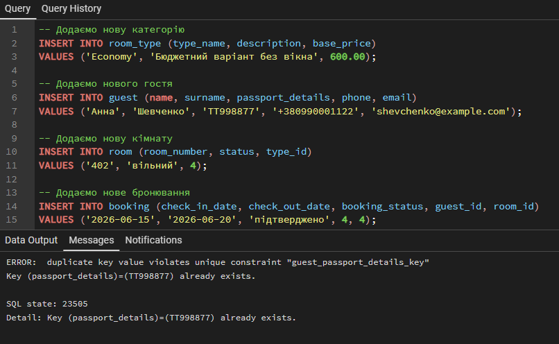
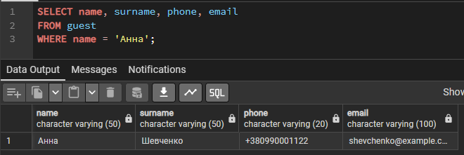
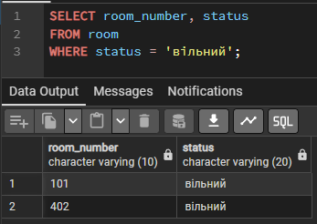
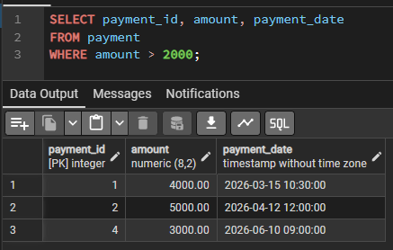
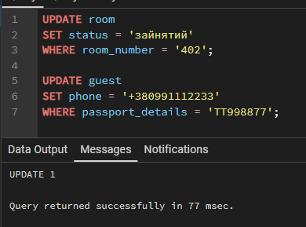
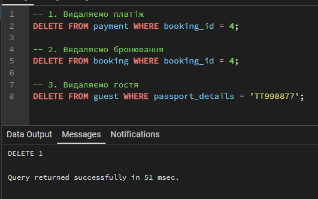

<div align="center">
  <strong>Міністерство освіти і науки України</strong><br>
  <strong>Національний технічний університет України</strong><br>
  <strong>«Київський політехнічний інститут імені Ігоря Сікорського»</strong><br><br>
  
  <h2>Лабораторна робота №3</h2>
  <h3>«Маніпулювання даними SQL (OLTP)»</h3><br>
  
  Київ 2026
</div>

<br>

**Роботу виконали:**
Студенти групи ІО-45, ІО-43
Ренцевич Д., Гапон А.

**Роботу перевірив:**
Русінов В.В.

---

## ЛАБОРАТОРНА РОБОТА № 3

**Тема:** Маніпулювання даними SQL (OLTP)

**Мета:** Вивчити основні операції маніпулювання даними (DML) у PostgreSQL. Набути практичних навичок написання транзакційних запитів SELECT, INSERT, UPDATE та DELETE для отримання, додавання, зміни та безпечного видалення записів, а також дослідити їх вплив на базу даних.

### Короткий опис фінальної схеми бази даних
* **room_type**: зберігає категорії номерів. Обмеження: базова ціна > 0.
* **guest**: зберігає інформацію про гостей. Обмеження: паспортні дані та email є унікальними (`UNIQUE`).
* **room**: облік номерного фонду. Має зовнішній ключ на `room_type`.
* **booking**: облік бронювань. Обмеження: дата виїзду більша за дату заїзду. Має зовнішні ключі на `guest` та `room`.
* **payment**: фіксація оплат. Має зовнішній ключ на `booking`.

### Практична частина: Маніпулювання даними (DML)

#### Перевірка обмежень цілісності бази даних (INSERT)
Під час спроби додати нові дані до таблиці `guest` спрацювало обмеження `UNIQUE` для поля `passport_details`. Це доводить, що база даних успішно блокує дублювання записів для гостей з однаковими паспортами.

*Код запиту:*
```sql
INSERT INTO room_type (type_name, description, base_price)
VALUES ('Economy', 'Бюджетний варіант без вікна', 600.00);

INSERT INTO guest (name, surname, passport_details, phone,
email)
VALUES ('Анна', 'Шевченко', 'TT998877', '+380990001122',
'shevchenko@example.com');

INSERT INTO room (room_number, status, type_id)
VALUES ('402', 'вільний', 4);

INSERT INTO booking (check_in_date, check_out_date,
booking_status, guest_id, room_id)
VALUES ('2026-06-15', '2026-06-20', 'підтверджено', 4, 4);

INSERT INTO payment (amount, payment_date, booking_id)
VALUES (3000.00, '2026-06-10 09:00:00', 4);
```



#### Вибірка даних (SELECT)
Для отримання даних з таблиць було використано оператор SELECT з фільтрацією умов через WHERE.

*Код запиту:*
```SQL
SELECT name, surname, phone, email 
FROM guest 
WHERE name = 'Анна';
```



*Код запиту:*
```SQL
SELECT room_number, status 
FROM room 
WHERE status = 'вільний';
```



*Код запиту:*
```SQL
SELECT payment_id, amount, payment_date 
FROM payment 
WHERE amount > 2000;
```



#### Оновлення даних (UPDATE)
Було проведено точкові зміни існуючих записів із використанням умови WHERE, щоб уникнути масового оновлення всієї таблиці.

*Код запиту:*
```SQL
UPDATE room 
SET status = 'зайнятий' 
WHERE room_number = '402';

UPDATE guest 
SET phone = '+380991112233' 
WHERE passport_details = 'TT998877';
```



#### Безпечне видалення даних (DELETE)
Видалення записів здійснювалося з урахуванням ієрархії зовнішніх ключів (Foreign Keys). Щоб видалити гостя, спочатку було видалено пов'язані з ним платежі та бронювання.

*Код запиту:*
```SQL
DELETE FROM payment WHERE booking_id = 4;
DELETE FROM booking WHERE booking_id = 4;
DELETE FROM guest WHERE passport_details = 'TT998877';
```



### Висновок:
Під час виконання лабораторної роботи №3 ми закріпили
навички маніпулювання даними (DML) для OLTP-систем у PostgreSQL на
базі розробленої схеми «Готель». На практиці було застосовано оператор
SELECT для точної вибірки даних із фільтрацією WHERE, а також
UPDATE для безпечного оновлення окремих записів. Операції DELETE
продемонстрували необхідність дотримання ієрархії зовнішніх ключів при
видаленні пов'язаних даних (від платежу до гостя). Крім того, ми успішно
перевірили роботу обмеження UNIQUE, яке заблокувало дублювання
паспортних даних при використанні INSERT. В результаті підтверджено,
що створена реляційна схема є надійною та готовою до обробки транзакцій
реальної інформаційної системи.


